# Sleep Puzzle
Live version: [sleeppuzzle.com](https://sleeppuzzle.com)

**Rails 8 storefront for a children's-sleep consultant.**

> It sells audio programmes and paid consultations, allows booking consultations through Google Calendar,
delivers the files from a signed CDN, lets the owner edit the site's content
without a redeploy.

## What it does

1. **Sells two things at once** - audiobooks delivered instantly with an option to preview the first 30 seconds of them, and consultation slots, which are fetched real time through Google Calendar.


2. **Takes payment through Paddle** as Merchant of Record, so VAT, invoicing and
   receipts are handled externally as opposed to **Stripe**


3. **Books against live availability** - free slots are computed from the owner's
   actual Google Calendar, fetching events from the API in order to block out
   unavailable times (not only bookings but also time off, holidays, etc.).


4. **Is edited by its owner.** Every heading, paragraph, stat and image on the public
   site is a content block the owner can change in both languages.


5. **Is bilingual** - Polish on the bare path, English under `/en`, down to the
   emails and the error pages.

## Screenshots

### What a buyer sees

| | |
| --- | --- |
| 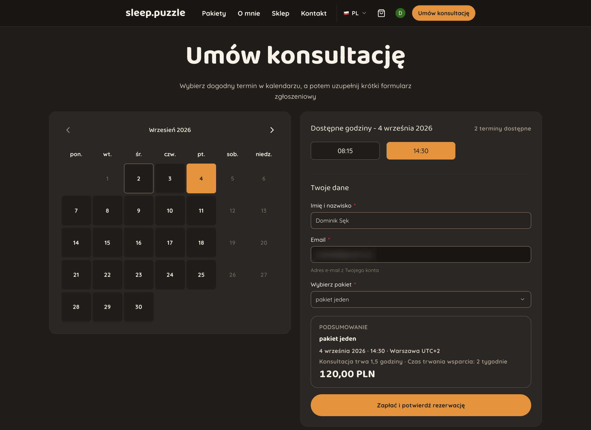 | 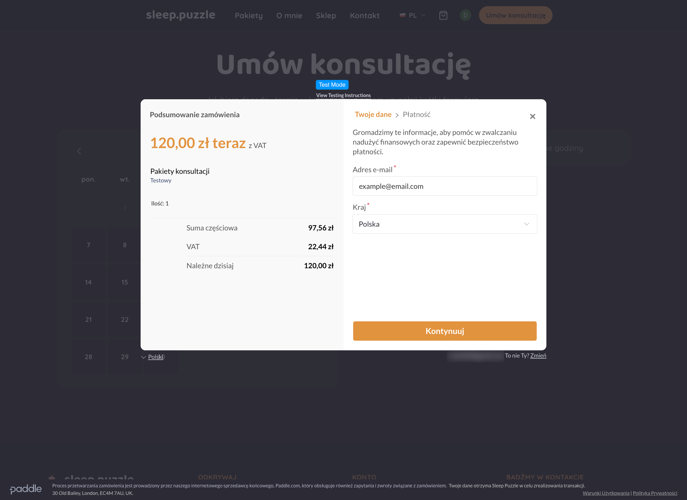 |
| **Booking a consultation.** The times offered are what is actually free in the owner's Google Calendar; the summary carries the timezone, the length and the price. | **Checkout.** Paddle's overlay - VAT, invoicing and the receipt are handled by the Merchant of Record. |
| 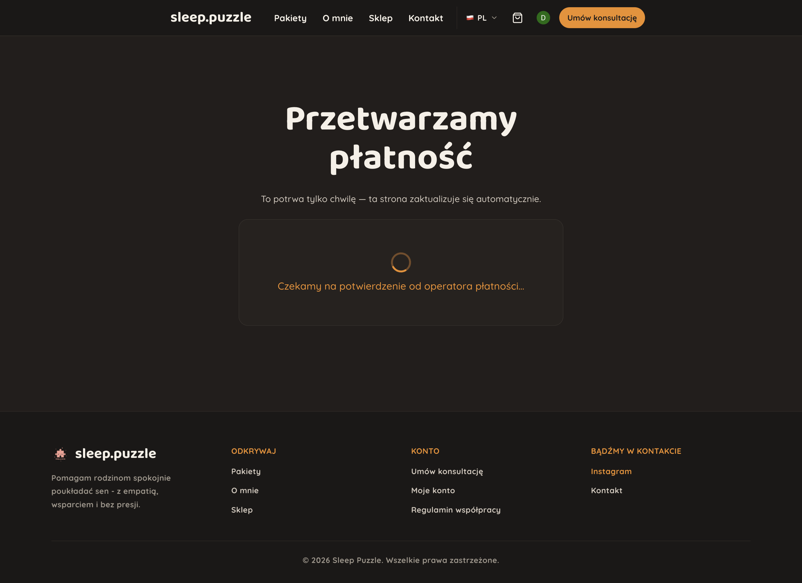 | 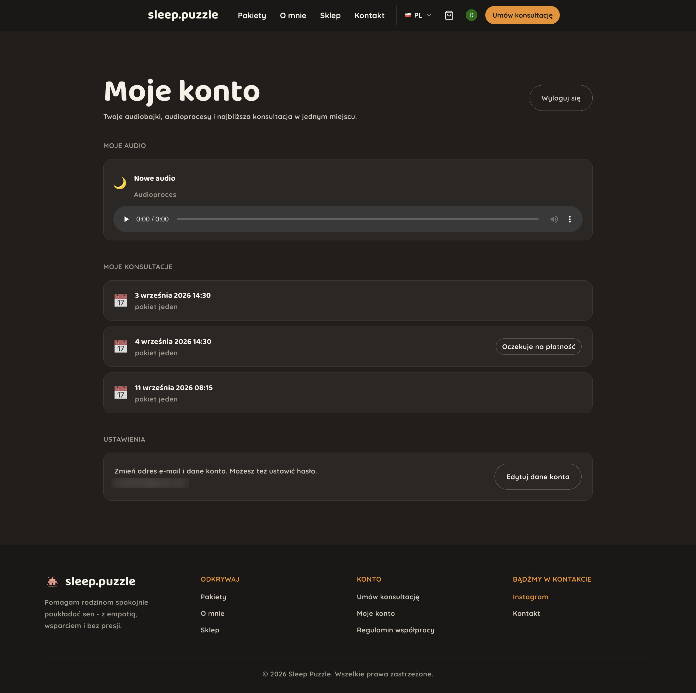 |
| **Waiting for payment screen.** Paddle confirms by webhook, so the order page holds this state and updates itself over Turbo Streams when the webhook comes through. | **Dashboard.** Purchased audio with a player, upcoming consultations, and a booking still awaiting payment shown as its own state rather than an error. |
| 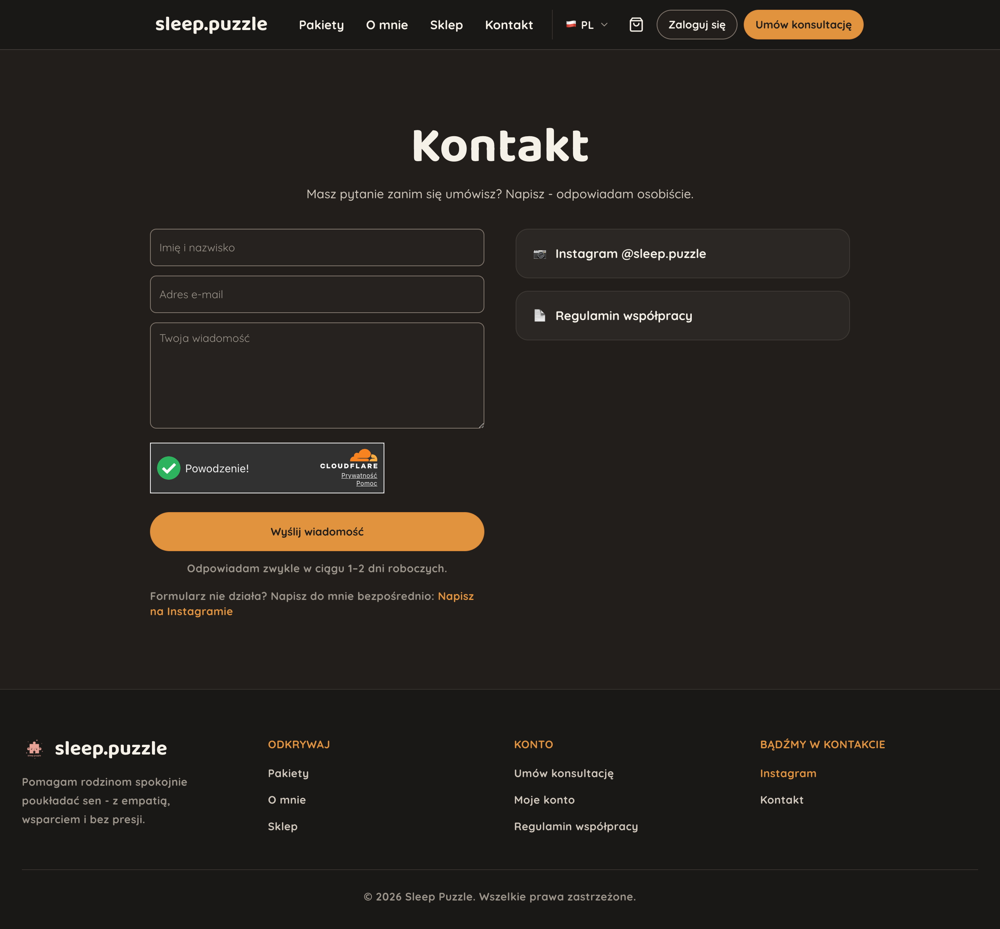 | 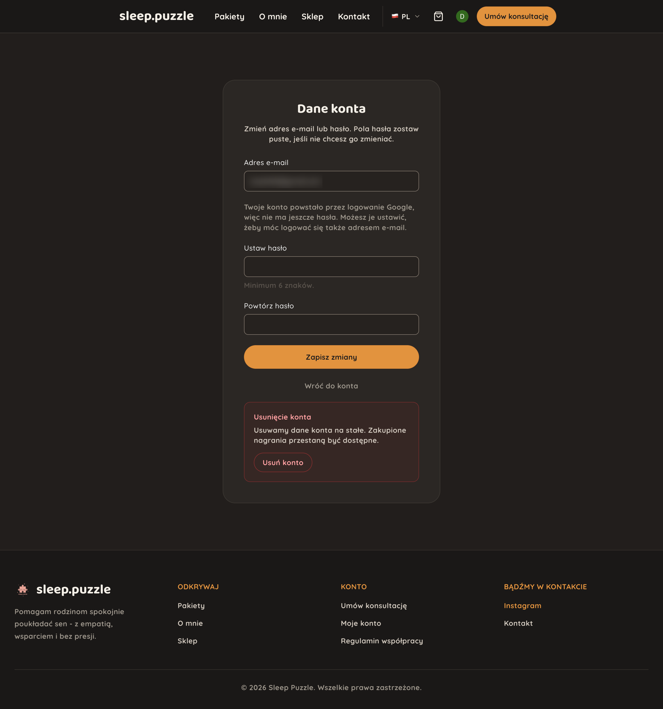 |
| **Contact.** Cloudflare Turnstile on submit, and a way out to Instagram in case the form itself fails. | **Account settings.** A Google sign-up has no password, so the form offers to set one instead of demanding the current one. |
| 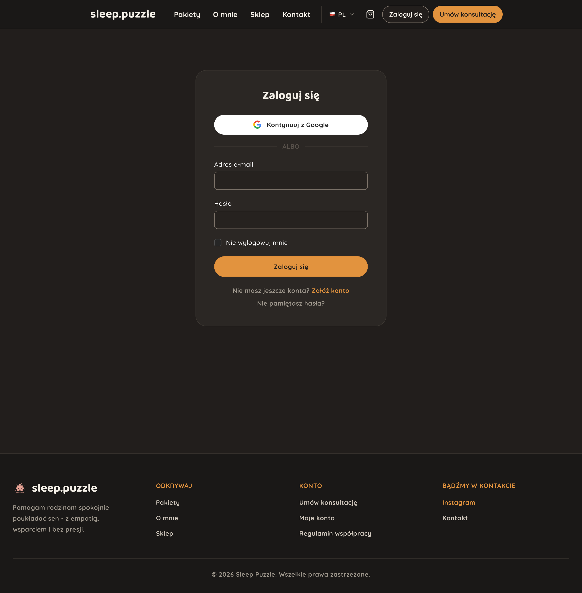 | 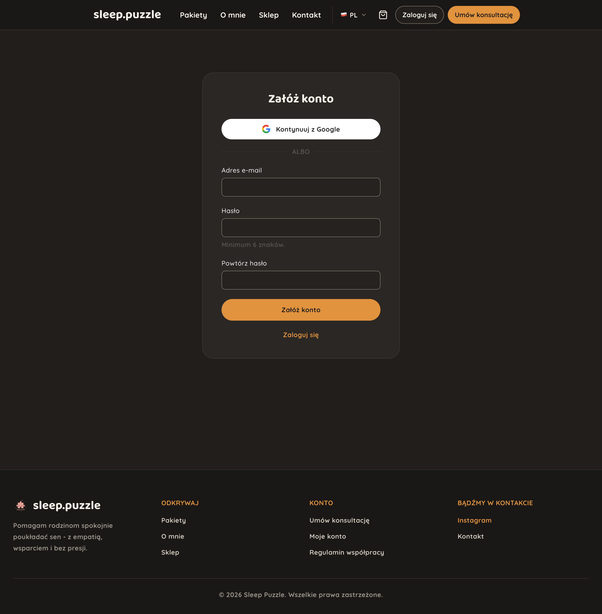 |
| **Login.** Google or e-mail and password, both landing on the same account - Devise and OmniAuth, not two parallel user models. | **Register.** The same two routes, and only e-mail and password are asked for - a name arrives either with the Google grant or with the booking that needs one. |

### What the owner sees

| | |
| --- | --- |
| 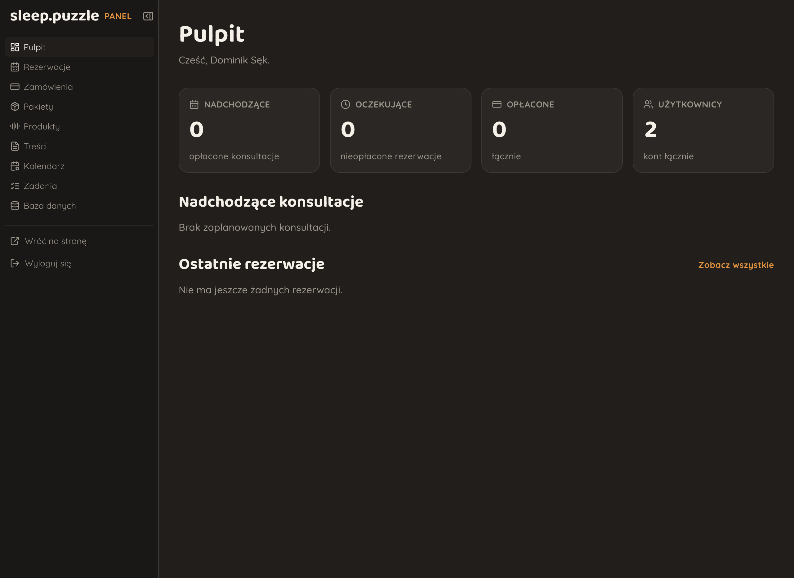 | 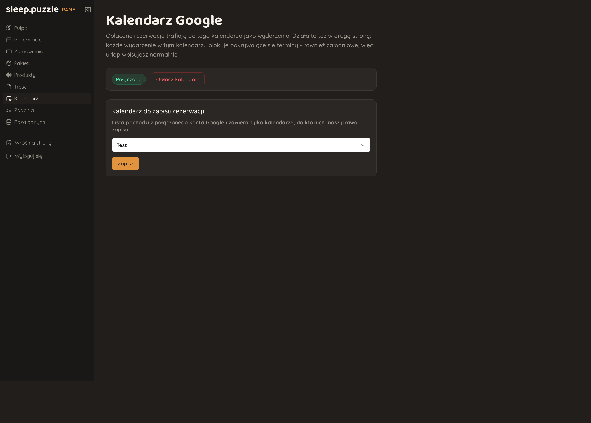 |
| **Panel.** Bookings, orders, packages, products, content, calendar, jobs and the database, all in Polish - it's staff-facing and the staff is Polish. | **Calendar.** Connect the Google account, then pick which calendar bookings are written to. |
| 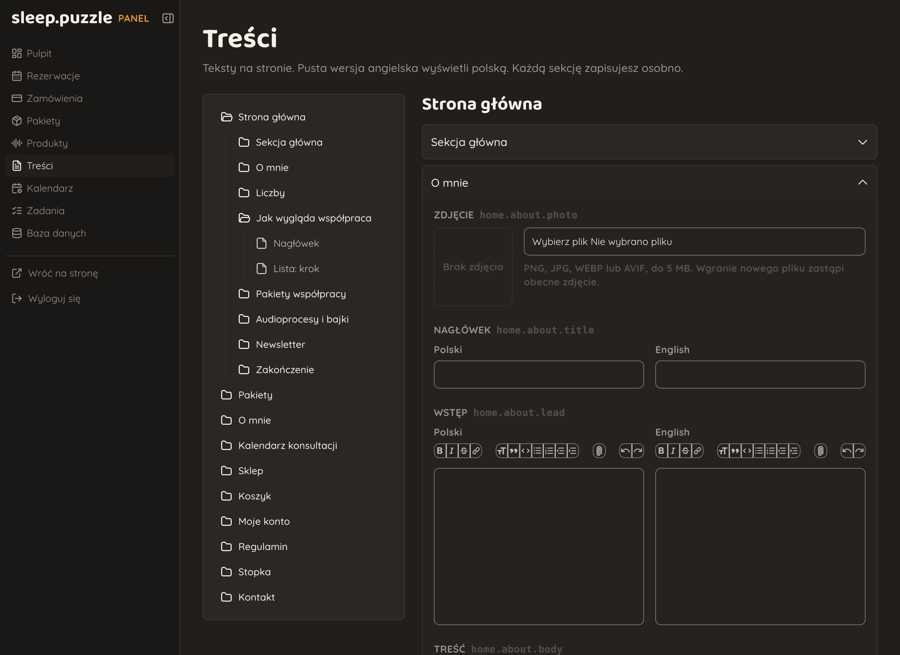 | 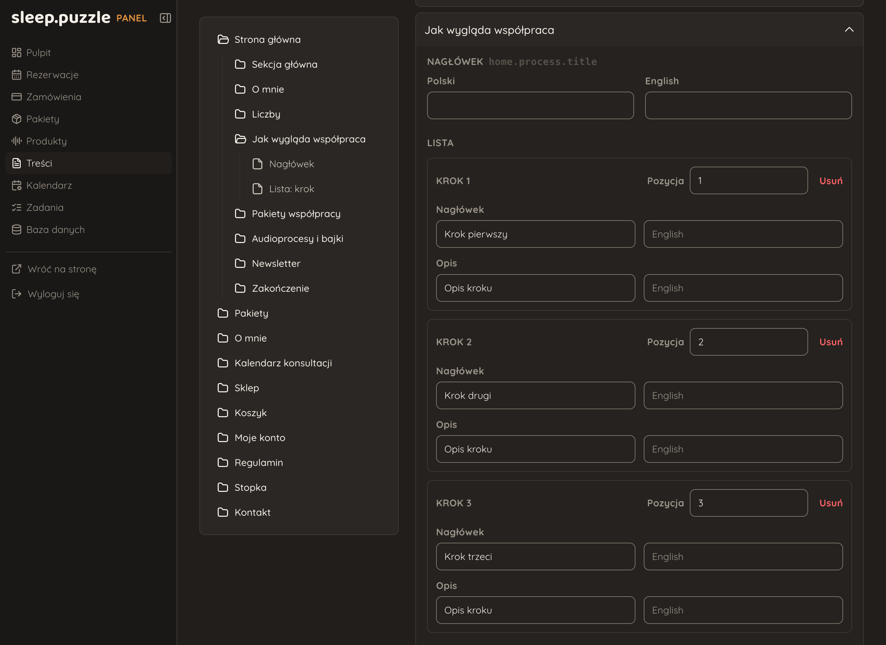 |
| **Content editing.** Every page, section and field comes from `content_blocks.yml`, with Polish and English side by side and a rich-text editor where the field asks for one. | **Collections.** Repeating sections the owner can add to, reorder and delete - the same YAML declaration, rendered as a list. |

## Stack

### App
- Ruby 4.0.5, Rails 8.1
- Hotwire (Turbo + Stimulus), ViewComponent, [RailsBlocks](https://railsblocks.com/)
- Tailwind 4 through Vite
- Devise + Google OAuth, Cloudflare Turnstile on public forms

### Storage
- PostgreSQL with Solid Queue, Cache and Cable
- Bunny CDN for the audio, behind signed URLs
- Active Storage with libvips for CMS images, ffmpeg for the 30-second previews

### Integrations
- Paddle as Merchant of Record, through the Pay gem
- Google Calendar API
- Brevo for transactional mail and the newsletter list

### Tests and ops
- RSpec, RuboCop, Brakeman and bundler-audit, run on GitHub Actions
- Kamal and Docker on a single VPS
- Cloudflare for TLS and redirects
- Sentry, PgHero and Mission Control Jobs

### AI
- Claude Code
- [Impeccable Style](https://impeccable.style/)

## The CMS schema is a YAML file

The owner is not a developer, and anything that can be reworded has to be editable
without a deploy.

`config/content_blocks.yml` **is the schema**: no Ruby names any field, and meaning
comes from nesting depth (page -> section -> field).

Adding an editable paragraph is four lines of YAML and
`content_block("footer.brand.tagline")` in the view.

## Running it locally

```sh
cp .env.example .env    # every variable is documented in there
bin/setup
bin/dev
```

Needs Ruby 4.0.5, PostgreSQL, libvips and ffmpeg.

## Docs

| | |
| --- | --- |
| [docs/content-blocks.md](docs/content-blocks.md) | The content-block schema in full |
| [PRODUCT.md](PRODUCT.md) | Who this is for and what it's meant to do |
| [DESIGN.md](DESIGN.md) | The design system it's built to |
